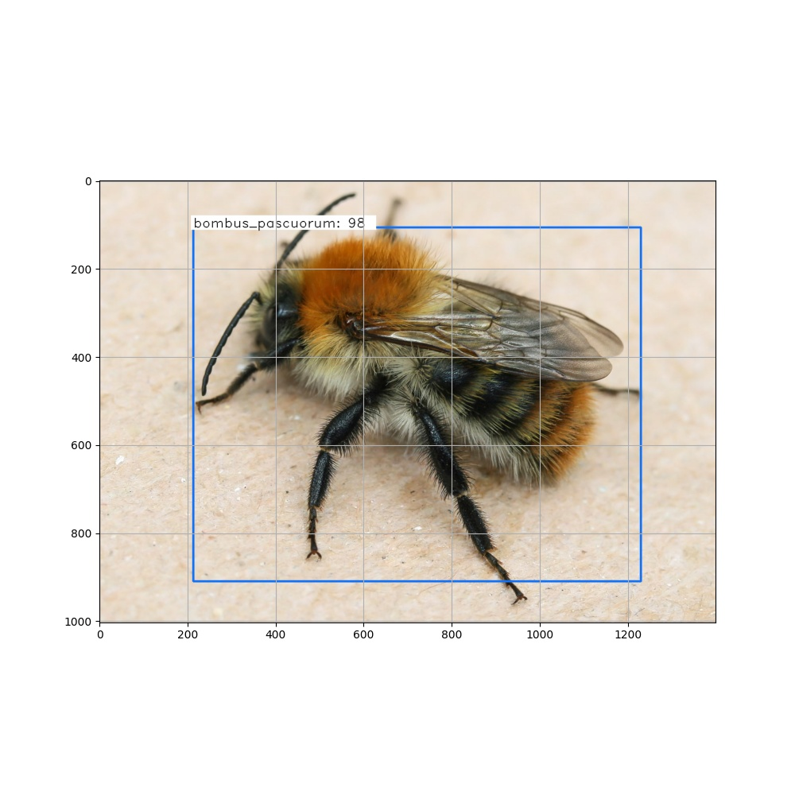

# Faster R-CNN for Insect Detection
## Introduction
This project is based on the code written by [RockyXu66](https://github.com/RockyXu66/Faster_RCNN_for_Open_Images_Dataset_Keras). We built our dataset using [gbif](https://www.gbif.org/) and [observations.be](https://observations.be/), and it is available in [this repository](https://github.com/vahidbe/Master_Thesis_Bees_Dataset). This code allows to train and test Faster R-CNN models (using the VGG16 backbone). The annotations taken as input must be in the [VIA](https://www.robots.ox.ac.uk/~vgg/software/via/via.html) format. See more information about this project in our [master thesis]().

Here you can find a few examples of the results produced by our model of 10 classes of Hymenoptera species on random images from google.

## Project Structure

The *frcnn_train.py* script allows to train an algorithm by providing its name (the model_name), the number of epochs, the original weights, the dataset path and the path to the annotation file. The parameter validation can be set to True to split the dataset in a training, validation and testing set and find the best combination of values among the list of hyper-parameters given. The parameter use_gpu can be set to False if you do not have a GPU on your machine (this will slow down the training).

The *frcnn_test.py* script allows to produce predictions on images, or to evaluate the mean Average Precision of a model.

The project contains scripts that facilitates the download of images from [gbif](https://www.gbif.org/), the logging of the losses during the training, the visualizations of the dataset and the results.

We also included a script *raspberry_real_time.py* (and related helper scripts) to run the detection on a raspberry pi equiped with a camera to automatically record the presence of detected species.

Finally, a script *add_meteorological_data.py* is provided to parse the results of the detections on raspberry pi and add data concerning the weather. This data can only be provided if you add a API key for the [OpenWeatherMap](https://openweathermap.org/) interface in the resources folder.